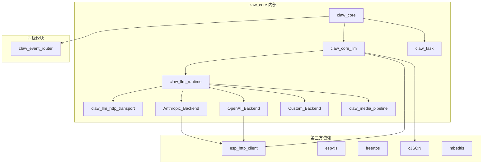
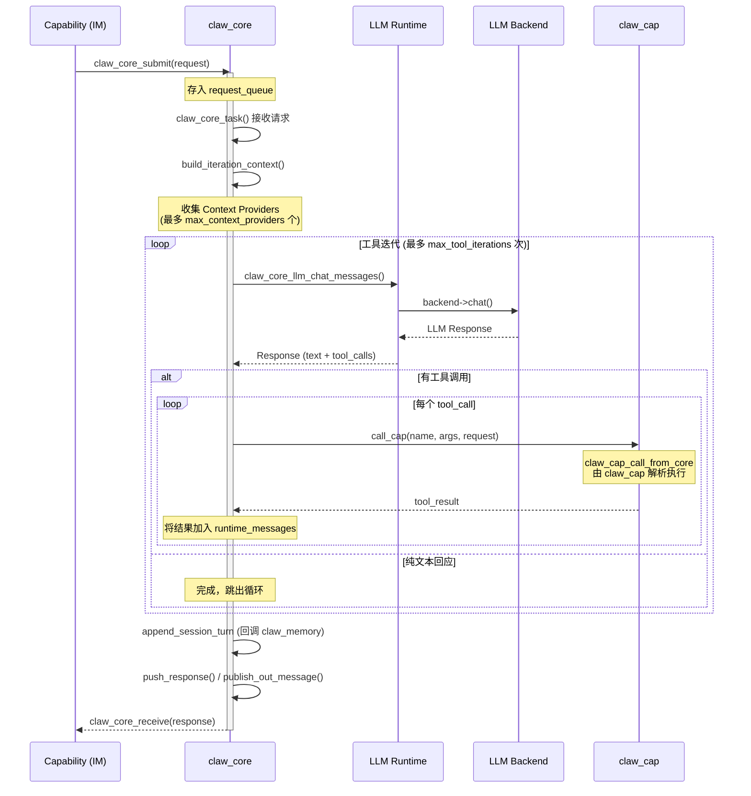
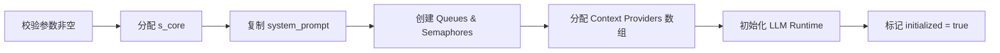

# claw_core（Agent Core）模块分析

## 概述

`claw_core` 是 ESP-Claw 框架的 **Agent Core（核心 AI 代理引擎）**，负责接收来自 IM 通道或其他来源的消息，在独立 FreeRTOS 任务中完成上下文拼装、调用大语言模型（LLM）、解析 Tool Call、通过统一入口执行能力，并按配置迭代多轮，直到模型给出最终文本或出错。

> **官方文档**：[Agent Core 参考](https://esp-claw.com/zh-cn/reference-core/claw-core/)

---

## 目录结构

```
claw_core/
├── CMakeLists.txt              # 组件构建配置
├── Kconfig                     # 菜单配置（Agent 阶段通知详细程度）
├── include/
│   ├── claw_core.h             # 核心公开 API 与数据结构
│   └── claw_task.h             # 任务创建与栈策略抽象
└── src/
    ├── claw_core.c             # 核心引擎实现（状态管理、请求循环）
    ├── claw_core_llm.c         # LLM 代理层（胶水层，封装 runtime）
    ├── claw_core_llm.h         # LLM 代理层头文件
    ├── claw_task.c             # FreeRTOS 任务创建包装
    └── llm/
        ├── claw_llm_types.h    # LLM 相关的类型定义
        ├── claw_llm_runtime.c  # LLM 运行时（配置、后端选择、生命周期）
        ├── claw_llm_runtime.h  # LLM 运行时 API + 后端虚表接口
        ├── claw_llm_http_transport.c  # HTTP JSON 传输层
        ├── claw_llm_http_transport.h
        ├── backends/
        │   ├── claw_llm_backend_anthropic.c      # Anthropic API 后端
        │   ├── claw_llm_backend_anthropic.h
        │   ├── claw_llm_backend_openai_compatible.c  # OpenAI 兼容后端
        │   ├── claw_llm_backend_openai_compatible.h
        │   ├── claw_llm_backend_custom.c         # 自定义后端
        │   └── claw_llm_backend_custom.h
        └── media/
            ├── claw_media_pipeline.c  # 多媒体资产处理管线
            └── claw_media_pipeline.h
```

---

## 模块依赖关系



---

## 核心架构

### 1. 整体数据流



### 2. 状态管理

核心状态保存在全局结构 `claw_core_state_t`（`s_core`）中：

| 字段 | 说明 |
|------|------|
| `initialized` | 初始化标志 |
| `started` | 是否已启动 worker task |
| `system_prompt` | 系统提示词 |
| `request_queue` | 请求队列（FreeRTOS Queue） |
| `response_queue` | 响应队列 |
| `inflight_request_id` | 当前正在处理的请求 ID |
| `inflight_abort` | 取消标志（volatile，供 HTTP abort 使用） |
| `context_providers[]` | 上下文提供者动态数组 |
| `completion_observers[]` | 完成观察者数组（最多 4 个） |
| `pending_head/tail` | 未匹配响应的暂存链表 |

---

## 数据结构分析

### 3. 请求 (`claw_core_request_t`)

包含单次交互所需的全部元数据：

| 字段 | 说明 |
|------|------|
| `request_id` | 请求唯一 ID |
| `flags` | 标志位组合（见下） |
| `session_id` | 会话标识（Console 里 `session` 命令切换；IM 路由按策略生成） |
| `user_text` | 用户输入正文 |
| `source_channel` | 来源通道（如 `im.wechat`） |
| `source_chat_id` | 来源聊天 ID |
| `source_sender_id` | 发送者 ID |
| `source_message_id` | 来源消息 ID |
| `source_cap` | 来源 Capability 名称 |
| `target_channel` | 目标通道（可覆盖回复通道） |
| `target_chat_id` | 目标聊天 ID |

> `source_*` / `target_*` 字段会原样传入 `claw_cap_call_from_core`，以便在 Capability 层定向回复或关联上下文。

#### 请求标志

| 标志 | 值 | 说明 |
|------|----|------|
| `CLAW_CORE_REQUEST_FLAG_PUBLISH_OUT_MESSAGE` | `1U << 0` | Agent 完成推理后，将响应以 `out_message` 事件发布到 Event Router |
| `CLAW_CORE_REQUEST_FLAG_SKIP_RESPONSE_QUEUE` | `1U << 1` | 跳过响应队列，不通过 `claw_core_receive` 返回结果 |

> Event Router 的 `run_agent` 动作会同时设置这两个标志，实现异步提交 + 事件发布的响应路径。

### 4. 响应 (`claw_core_response_t`)

| 字段 | 说明 |
|------|------|
| `request_id` | 对应请求 ID |
| `status` | `OK` 或 `ERROR` |
| `completion_type` | 完成类型（目前仅 `DONE`） |
| `target_channel` | 回复通道 |
| `target_chat_id` | 回复聊天 ID |
| `text` | 助手回复正文 |
| `error_message` | 错误信息 |

### 5. 配置 (`claw_core_config_t`)

| 字段 | 说明 |
|------|------|
| `api_key` | API 密钥，必填 |
| `backend_type` / `profile` / `provider` | LLM 路由配置。`profile` 与 `provider` 二选一即可 |
| `model` / `base_url` / `auth_type` | 模型标识、端点 URL、认证方式 |
| `timeout_ms` / `max_tokens` / `image_max_bytes` | LLM 参数 |
| `system_prompt` | 系统提示词，**必填**（`claw_core_init` 会校验非空） |
| `append_session_turn` | 会话记录回调（`edge_agent` 设为 `claw_memory_append_session_turn_callback`） |
| `on_request_start` | 请求开始回调 |
| `collect_stage_note` | 阶段备注回调 |
| `call_cap` | **核心回调** — 执行工具调用（`edge_agent` 指向 `claw_cap_call_from_core`） |
| `task_stack_size` / `task_priority` / `task_core` | FreeRTOS 任务资源配置 |
| `max_tool_iterations` | 最大工具迭代次数（默认 10） |
| `request_queue_len` / `response_queue_len` | 请求/响应队列深度（默认 4） |
| `max_context_providers` | 最多可注册的 provider 数量 |

---

## 关键函数流程

### 6. `claw_core_init()`



> 当 API Key、profile、model 不全时，`app_claw_start` 会跳过 `claw_core_init` / `claw_core_start` 并打印日志。此时依赖 LLM 的 `ask`、Event Router 发往 Agent 的路由（含 fallback 路由）、图片 inspect 等能力不可用。但 Event Router、自动化、本地 Capability、Console REPL 仍可工作。

### 7. `claw_core_task()` — 主循环

这是核心的 FreeRTOS worker task，流程如下：

1. **接收请求**：从 `request_queue` 阻塞等待
2. **标记在途**：设置 `inflight_request_id`，武装 HTTP abort
3. **准备目标**：复制 `target_channel` / `target_chat_id`
4. **触发 `on_request_start`** 回调
5. **创建 `runtime_messages`**：存放工具调用历史
6. **迭代循环**（最多 `max_tool_iterations` 次）：
   - `build_iteration_context()`：收集所有 Context Provider，构建 system_prompt + messages + tools_json
   - `claw_core_llm_chat_messages()`：调用 LLM
   - 若无 tool_call → 完成，跳出
   - 若有 tool_call → `append_assistant_tool_calls()` + `append_tool_results_message()`（通过 `call_cap` 回调依次执行）
7. **完成处理**：
   - 调用 `append_session_turn`（`edge_agent` 中为 `claw_memory_append_session_turn_callback`）保存会话
   - 通知 `completion_observers`
   - `publish_out_message_if_requested()`：可选地发布 `out_message` 事件到 Event Router
   - `push_response()`：将结果送入 `response_queue`

### 8. 迭代上下文构建 (`build_iteration_context()`)

每次迭代都会重新构建完整的 LLM 请求上下文：

1. **复制 system_prompt**
2. **遍历所有 Context Provider**，依 `kind` 区分：
   - `SYSTEM_PROMPT` → 附加到 system_prompt
   - `MESSAGES` → 合并到 messages 数组
   - `TOOLS` → 合并到 tools 数组
3. **附加 Current Turn Context**（包含 request_id、来源信息、**Behavior Notes**）
4. **附加用户输入**
5. **附加 runtime_messages**（工具调用历史）

> **Behavior Notes**：在拼装当前轮用户提示时，`claw_core` 会附带一段说明，指出最终助手结果通常会由框架自动投递给用户，因此一般不必再主动调用 `cap_im_platform` 中的 IM 发送接口返回正文（减少重复回复）。

#### `edge_agent` 注册的 Context Provider（按固定顺序）

| 序号 | Provider | 类型 |
|------|----------|------|
| 1 | `claw_memory_profile_provider` | 可编辑人设与画像 |
| 2 | `claw_memory_long_term_provider`（完整）或 `claw_memory_long_term_lightweight_provider`（轻量） | 长期记忆 |
| 3 | `claw_memory_session_history_provider` | 会话历史 |
| 4 | `claw_skill_skills_list_provider` | Skills 目录 |
| 5 | `claw_skill_active_skill_docs_provider` | 已激活 Skill 文档 |
| 6 | `claw_cap_tools_provider` | 当前可见工具列表 |
| 7 | `cap_lua_async_jobs_provider` | Lua 异步任务状态 |
| 8 | `cap_time_context_provider` | 当前设备时间上下文 |

> 因此，大语言模型最终接收的工具列表，不仅取决于注册了哪些 Capability，还取决于 `claw_cap_set_llm_visible_groups`。`edge_agent` 默认只对 LLM 暴露 `cap_files`、`cap_skill`、`cap_system`、`cap_lua`（完整结构化记忆模式还包含 `claw_memory`）。其余能力通常需要先激活对应 Skill，模型才能同时获得「工具可见性 + 使用说明」。

---

## 请求取消

`claw_core_cancel_request(request_id)` 用于取消当前正在执行的请求：

- `request_id == 0`：取消任意当前 in-flight 请求
- `request_id != 0`：仅当当前 in-flight 请求 ID 匹配时才生效
- 若没有可取消的请求，返回 `ESP_ERR_NOT_FOUND`

该取消是**协作式中断**，主要用于中止进行中的 LLM HTTP 请求；请求结束后，错误信息会被统一标记为 `request cancelled`，便于上层识别。

---

## 完成观察器

`claw_core_add_completion_observer` 允许注册完成观察器，在每次请求结束后接收 `claw_core_completion_summary_t`：

| 字段 | 说明 |
|------|------|
| `request_id` | 请求标识 |
| `session_id` | 会话标识（可为 NULL） |
| `final_text` | 本轮最终回复文本（可能为空） |
| `context_providers_csv` | 本轮注入了非空上下文的 provider 列表（CSV） |
| `tool_calls_csv` | 本轮触发过的工具调用列表（CSV） |

> 该机制适合做审计、统计或「结果一致性」检查。`edge_agent` 注册了 `cap_lua_honesty_observe_completion` 作为 completion observer，用于检测模型回复中声称执行了 Lua 操作但实际未产生工具调用的情况，并在发现不一致时记录日志。

---

## LLM 层架构

### 9. 四层抽象

```
claw_core_llm  (胶水层，最上层 API)
      |
claw_llm_runtime  (运行时，选择后端、管理配置)
      |
claw_llm_backend_vtable  (后端虚表接口)
      |
      ├── OpenAI Compatible (支持 OpenAI / Qwen / 自定义兼容 API)
      ├── Anthropic (支持 Claude API)
      └── Custom (用户自定义后端)
```

### 10. Model Profiles

| Profile ID | 默认 Backend | 默认 Base URL | 支持 Tools | 支持 Vision |
|---|---|---|---|---|
| `openai` | openai_compatible | `https://api.openai.com/v1` | ✅ | ✅ |
| `qwen_compatible` | openai_compatible | `https://dashscope.aliyuncs.com/compatible-mode/v1` | ✅ | ✅ |
| `custom_openai_compatible` | openai_compatible | `https://api.openai.com/v1` | ✅ | ✅ |
| `anthropic` | anthropic | `https://api.anthropic.com/v1` | ✅ | ✅ |
| `custom_backend` | custom | (空) | ✅ | ✅ |

别名支持：`qwen` → `qwen_compatible`、`claude` → `anthropic`

### 11. HTTP 传输层 (`claw_llm_http_transport`)

- `claw_llm_http_post_json()`：发送 HTTP POST JSON 请求
- 支持自定义 headers
- 支持 abort 中断（通过 `volatile bool *flag`，在 `claw_core_task` 中与 `inflight_abort` 连接）
- 使用 `esp_http_client` 实现

---

## 多媒体处理

### 12. `claw_media_pipeline`

支持三种媒体资产类型：

| 类型 | 说明 |
|------|------|
| `LOCAL_PATH` | 本地文件路径（如 `/fatfs/image.jpg`） |
| `REMOTE_URL` | 远程 URL |
| `INLINE_BYTES` | 内联字节数据 |

处理后输出两种格式：
- `DATA_URL`：Base64 编码的 data URL
- `REMOTE_URL`：远程 URL（直接传递）

---

## FreeRTOS 任务管理

### 13. `claw_task` 模块

提供统一的任务创建接口，支持：

- **栈策略**：`INTERNAL_ONLY` / `PREFER_PSRAM` / `PSRAM_ONLY`
- **Override 表**：可通过静态表格覆盖特定任务的配置
- 底层使用 `xTaskCreatePinnedToCoreWithCaps()` 确保正确的内存属性

---

## Kconfig 配置选项

```menuconfig
ESP-Claw Core →
    Agent stage notification verbosity
    ├── Simple （默认） — 仅发送工具名称
    └── Verbose — 包含工具参数预览和迭代轮次
```

> 如需启用详细 Agent 工具调用过程输出，详见[数据流与自动化 - agent_stage 事件](https://esp-claw.com/zh-cn/reference-project/dataflow-and-automation#agent_stage-%E4%BA%8B%E4%BB%B6%E4%B8%8E%E6%89%A7%E8%A1%8C%E8%BF%87%E7%A8%8B%E9%80%9A%E7%9F%A5)。

---

## 设计模式与关键概念

### 14. 回调驱动架构

| 回调 | 用途 | 设置时机 |
|------|------|----------|
| `call_cap` | **核心** — 执行工具调用（`edge_agent` 指向 `claw_cap_call_from_core`） | init |
| `append_session_turn` | 保存会话历史（`edge_agent` 设为 `claw_memory_append_session_turn_callback`） | init |
| `on_request_start` | 请求开始通知 | init |
| `collect_stage_note` | 阶段备注收集 | init |
| `context_providers` | 动态注入上下文（8 个固定 provider） | init 后、start 前 |
| `completion_observers` | 完成后观察通知（如 `cap_lua_honesty_observe_completion`） | init 后、任何时候 |

### 15. 请求/响应模型

- **异步队列**：请求通过 `request_queue` 送入，响应通过 `response_queue` 取出
- **请求取消**：支持按 request_id 取消，通过 `inflight_abort` 标志中断 HTTP 请求
- **Pending 响应**：若接收方指定了特定的 request_id，不匹配的响应会暂存于 pending 链表

### 16. 事件发布

- 可选地将 Agent 回复以 `out_message` 事件发布到 `claw_event_router`（通过 `CLAW_CORE_REQUEST_FLAG_PUBLISH_OUT_MESSAGE` 标志）
- 阶段通知（`agent_stage` 事件）可根据 Verbosity 配置决定详细程度

---

## 小结

`claw_core` 是一个 **嵌入式 AI Agent 引擎**，在 ESP32 上实现了完整的 LLM 驱动代理循环：

1. **异步请求处理** — 基于 FreeRTOS Queue 的生产者-消费者模型
2. **多 LLM 后端支持** — OpenAI 兼容 / Anthropic / 自定义
3. **工具调用迭代** — 通过 `call_cap` 回调委托给 `claw_cap` 执行，支持多轮迭代
4. **插件化上下文** — Context Provider 机制，`edge_agent` 注册了 8 个固定 provider
5. **完善的错误处理** — 会话失败跟踪、请求取消、超时控制、LLM 不可用降级
6. **多媒体支持** — 本地图片 / 远程 URL / 内联数据处理管线
7. **可观测性** — Completion Observer 机制（如 Lua 诚实性检查）、阶段事件通知
